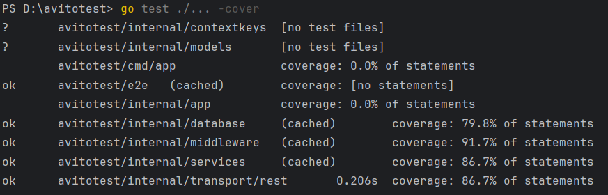
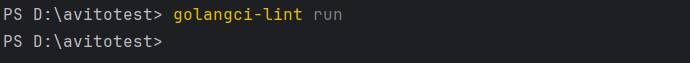
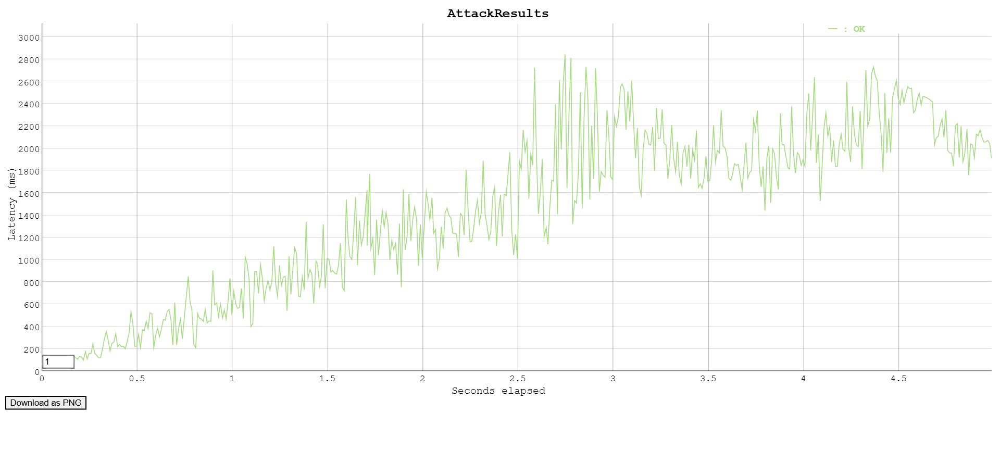
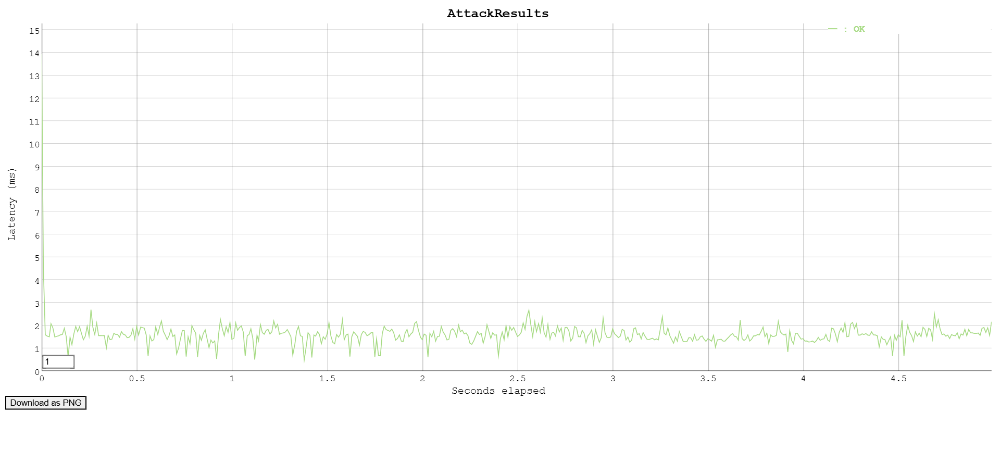
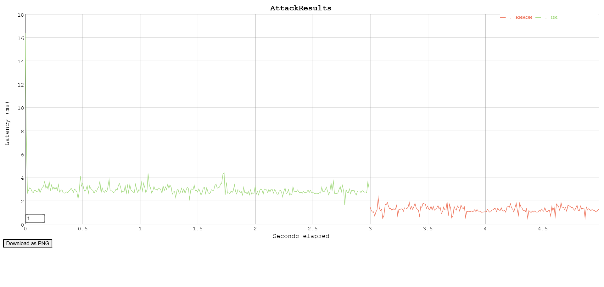
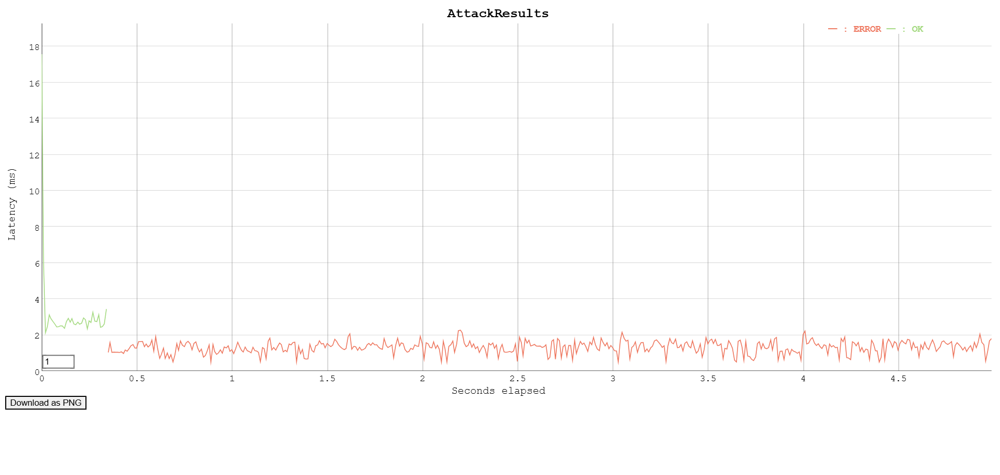

# How to Run

Navigate to the root of the project and execute:

```docker-compose up```

# Stack

The following stack was used:
+ Go
+ PostgreSQL
+ Docker Compose

The user's password is stored in the database as a bcrypt hash.

JWT tokens are signed using SHA512 with HMAC, and the secret is stored as an environment variable named SECRET.

# Tests and Coverage

e2e tests have been written for all 4 scenarios.
Unit tests have over 80% coverage. e2e tests can be found in the [e2e](e2e) directory. 



# Linter

The linter configuration is described in [.golangci.yml](./.golangci.yml)

Everything runs successfully with no errors (all issues have been fixed):



# Load Testing

Load testing was performed using Vegeta with the following commands:

```vegeta attack -duration=5s -rate=100 -targets=D:\avitotest\vegetatests\auth\authtest.list -output=results.bin```

```vegeta plot -title=AttackResults results > results.html```

The test files and results are available in the [vegetatests](vegetatests) directory.

The containers were deployed using Docker Desktop.

/api/auth:



/api/info:



/api/sendCoin (errors are due to insufficient coins for sending):



/api/buy/{item} (errors are due to insufficient coins for purchase):

